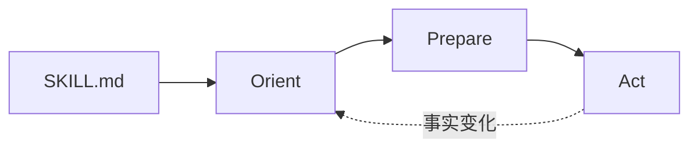

# DevGuard

Progressive-loading AI development guardrails for coding, bug fixing, UI implementation, refactors, reviews, and release checks.

[](LICENSE)
[](https://github.com/rainiva/DevGuard/tags)
[](https://github.com/rainiva/DevGuard/issues)

DevGuard 是一套面向编码、修 Bug、UI 落地、重构迁移、发布检查和代码审查的渐进式 AI 开发治理技能。它的职责不是直接替代具体实现技能，而是在真正执行前，把任务先路由清楚、把规则按需加载清楚、把影响分析清楚、把 Task Contract 冻结清楚，再进入 TDD 和执行。

**工作流权威入口**：[SKILL.md](SKILL.md)（三相 Orient → Prepare → Act）

## Core Principle

先路由，再加载。先理解，再分析。先冻结，再测试。先验证，再宣称完成。**最小改动：在 Task Contract 范围内，用能正确解决问题的最简单 diff。**

## What DevGuard Solves

- 任务一上来就开始写代码，没有先判断任务类型、风险和范围
- 规则体系越做越大，结果每次都把所有规则全量加载，浪费 token
- 还没理解项目结构、入口和调用链，就直接做 Impact Analysis 或直接改代码
- 平台、框架、SDK、宿主约束本来应该先查官方资料，却被跳过
- 任务边做边扩，最后无法证明“这次到底允许改什么、算不算完成”
- 没有失败测试、没有复现证据、没有回归验证，却宣称修复完成

## Architecture (P7)

对外只有 **三相** 工作流（详见 [control-plane-core.md](references/control-plane-core.md)）：

| Phase | 对外默认 | 内部 |
|---|---|---|
| **Orient** | `Execution Summary` + `Task Contract Summary`；LITE 用 ES+`Slice`；模糊目标用 `Inquiry Note` | 路由、苏格拉底追问、规则加载计划 |
| **Prepare** | 默认静默 | 项目理解 → 官方文档? → 影响分析 → Contract 冻结 |
| **Act** | `Completion Summary` / `Review Summary` | TDD → 领域执行 → 审查 |

查表：[devguard-lookup.md](references/devguard-lookup.md)  
模块注册表：[devguard-module-registry.md](references/devguard-module-registry.md)（`skills/*/SKILL.md` 多为 stub，权威在 `references/*-core.md`）



## Routing, Loading, Output

- 路由与执行模式：[task-routing.md](references/task-routing.md)
- 规则层次与按需加载：[rule-loading.md](references/rule-loading.md)
- 默认外显：`Execution Summary` + `Task Contract Summary`；高风险 + `Risk Note`；异常 + `Exception Note`
- T1/T2 模板：[report-templates.md](references/report-templates.md)；T3 审计模板：[report-templates-detailed.md](references/report-templates-detailed.md)
- 硬门禁：[shared-guardrails.md](references/shared-guardrails.md)

## Directory Layout

```text
devguard/
|- SKILL.md                 # 唯一工作流入口
|- README.md
|- CHANGELOG.md
|- agents/openai.yaml
|- skills/                  # 可选 discoverability stubs（见 module-registry）
|- references/              # 权威规则与模板
|  |- control-plane-core.md
|  |- devguard-lookup.md
|  |- devguard-module-registry.md
|  |- task-routing.md
|  |- report-templates.md
|  |- report-templates-detailed.md
|  \- ...
|- docs/
|  |- REFINEMENT_PLAN.md
|  |- REFINEMENT_PLAN_P7.md
|  \- REFINEMENT_BASELINE.md
|- skillopt/
|  |- benchmark.jsonl       # 18 条
|  |- held-out.jsonl        # 3 条
|  \- simulate_fixtures.json
|- playbooks/
|- project-rules/example/
\- scripts/
   |- check_devguard_bundle.py
   |- simulate_scenarios.py
   |- validate_outward_packet.py
   |- sync_devguard_install.py
   |- gen_skillopt.py
   \- run_skillopt_judge.py
```

## Validation

每次修改披露策略、路由或 Contract 规则后运行：

```bash
python scripts/check_devguard_bundle.py --skill-dir .
python scripts/run_skillopt_judge.py --skill-dir . --dataset all --minimum-rows 16
python scripts/simulate_scenarios.py
```

**Fresh-agent 回归**（21 场景）：新线程按 `skillopt/benchmark.jsonl` + `held-out.jsonl` 提示词跑 DevGuard，将外显 transcript 保存后用 judge 打分：

```bash
python scripts/run_skillopt_judge.py --skill-dir . --dataset all \
  --task-id feature-normal --transcript path/to/transcript.md
```

held-out 场景打分必须带 `--dataset all`。人工 spot-check 见 [forward-testing.md](references/forward-testing.md)。

CI（`.github/workflows/ci.yml`）在 `main` / `release/**` 上自动跑 bundle + skillopt + simulate。

## Quick Start

```text
Use $devguard: Orient->Prepare->Act per SKILL.md. Outward ES+TCS only before coding.
```

短触发：`/devguard lite` | `/devguard fast` | `/devguard strict` | `/devguard review` — 见 [example-prompts.md](references/example-prompts.md)。

**LITE** 日常微改：`` `/devguard lite` fix typo in {file} `` — `Slice` 嵌在 ES，无单独 TCS。

## Install Copies

Canonical 源为本仓库。同步到本地技能目录：

```bash
python scripts/sync_devguard_install.py --target cursor
python scripts/sync_devguard_install.py --target codex
```

## Release

| Tag | 要点 |
|---|---|
| [v0.3.0](https://github.com/rainiva/DevGuard/releases/tag/v0.3.0) | P7 三相控制面、单入口/单查表、T3 外置、skillopt 18+3、fresh-agent 21/21 |
| [v0.2.0](https://github.com/rainiva/DevGuard/releases/tag/v0.2.0) | P0–P6 精炼、LITE 模式、Output Tier Model |
| [v0.1.0](https://github.com/rainiva/DevGuard/releases/tag/v0.1.0) | 初始公开 bundle |

完整变更：[CHANGELOG.md](CHANGELOG.md)

## Scope Note

`playbooks/` 与 `project-rules/example/` 仅作结构示例。真实项目应在 `project-rules/<project>/` 下维护专属规则包，不要混入 DevGuard 通用层。
