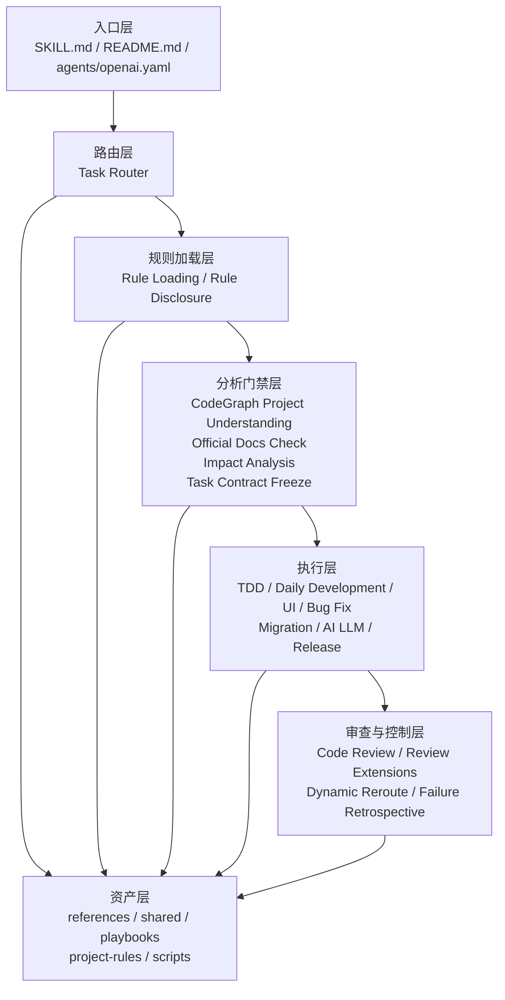
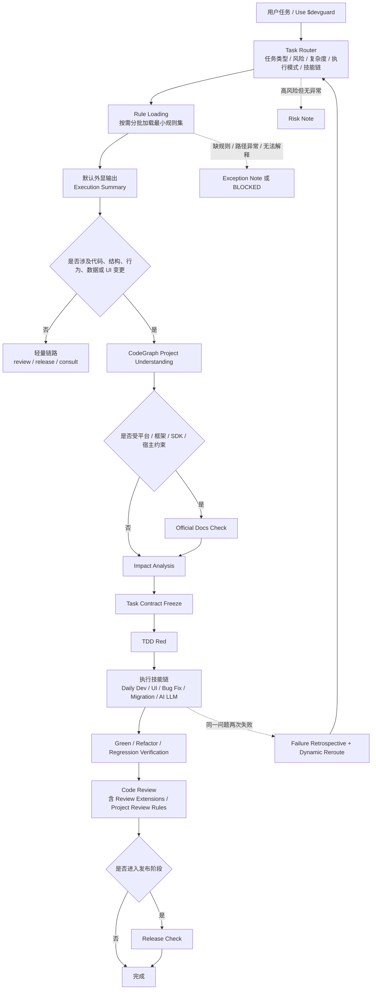

# DevGuard

Progressive-loading AI development guardrails for coding, bug fixing, UI implementation, refactors, reviews, and release checks.

[](LICENSE)
[](https://github.com/rainiva/DevGuard/tags)
[](https://github.com/rainiva/DevGuard/issues)

DevGuard 是一套面向编码、修 Bug、UI 落地、重构迁移、发布检查和代码审查的渐进式 AI 开发治理技能。它的职责不是直接替代具体实现技能，而是在真正执行前，把任务先路由清楚、把规则按需加载清楚、把影响分析清楚、把 Task Contract 冻结清楚，再进入 TDD 和执行。

## Core Principle

先路由，再加载。先理解，再分析。先冻结，再测试。先验证，再宣称完成。

## What DevGuard Solves

DevGuard 主要解决这几类问题：

- 任务一上来就开始写代码，没有先判断任务类型、风险和范围
- 规则体系越做越大，结果每次都把所有规则全量加载，浪费 token
- 还没理解项目结构、入口和调用链，就直接做 Impact Analysis 或直接改代码
- 平台、框架、SDK、宿主约束本来应该先查官方资料，却被跳过
- 任务边做边扩，最后无法证明“这次到底允许改什么、算不算完成”
- 没有失败测试、没有复现证据、没有回归验证，却宣称修复完成

## Design Principles

- 渐进式加载：规则按层、按阶段、按风险加载，而不是一次性全读
- CodeGraph 优先：代码修改前先做项目结构理解，优先结构化工具而不是全文搜索猜测
- 官方约束前置：平台、框架、SDK、宿主、控件模板等敏感任务先做 Official Docs Check
- Task Contract 冻结：影响分析之后、编码之前，冻结目标、范围、约束、测试要求和验收标准
- TDD 与证据优先：没有失败测试、最小复现或证据链，不应宣称完成
- 披露与执行分离：内部执行可以严格，外部输出默认保持最小摘要

## Architecture Overview

DevGuard 当前由 6 个层次组成：

1. 入口层：定义 DevGuard 的外部入口、默认提示词和总职责
2. 路由层：识别任务类型、风险、复杂度、执行模式和技能链
3. 规则加载层：按 `Meta -> Core -> Extensions -> Project Rules -> Playbooks -> Review Extensions` 逐层加载
4. 分析门禁层：项目结构理解、官方文档约束确认、Impact Analysis、Task Contract 冻结
5. 执行层：TDD、日常开发、UI、Bug Fix、迁移重构、AI/LLM、发布检查
6. 审查与控制层：Code Review、Review Extensions、Dynamic Reroute、Failure Retrospective



## Runtime Flow

DevGuard 的真实运行顺序不是“读完所有规则后直接写代码”，而是下面这条受门禁控制的链路：



## Routing Model

路由层内部会统一决定这些字段：

- 任务类型：`feature`、`change`、`ui`、`bugfix`、`refactor`、`migration`、`review`、`release`、`ai_llm`、`performance` 等
- 风险标签：如 `api_contract`、`auth_permission`、`rollback`、`codegraph_required`、`official_docs_required`
- 复杂度：`S0` 到 `S4`
- 执行模式：`FAST`、`STANDARD`、`STRICT`
- 输出档位：`summary`、`focused-expansion`、`detailed`
- 技能链：根据任务家族决定需要串联哪些内部模块

执行模式决定流程严格度，不自动决定披露详细度。`STRICT` 不等于默认输出完整大清单。

## Rule Loading Model

规则加载采用固定层次模型：

1. `Meta rules`
2. `Core skill`
3. `Extensions`
4. `Project rules`
5. `Playbooks`
6. `Review extensions`

加载原则：

- 按需加载
- 按阶段加载
- 优先摘要，再按需要读完整规则
- 风险上升、阶段切换、问题复现失败、进入 review/release 时动态补载

默认不要把所有规则、所有 playbook、所有项目规则全量读进来。

## Output Policy

DevGuard 将“执行严谨度”和“外显披露大小”分开处理。

### Default

普通任务默认只输出：

- `Execution Summary`
- `Task Contract Summary`

### Focused Expansion

高风险或异常任务默认只展开受影响的部分：

- 高风险但无异常：`Execution Summary + Risk Note + Task Contract Summary`
- 规则异常：`Execution Summary + Exception Note + Task Contract Summary`，如果 Contract 还不能成立则直接阻断

### Detailed

只有在以下场景才进入完整报告：

- 用户显式要求 `debug`、`verbose`、`audit`、`full detail`
- Forward Testing 或正式证据留存需要完整模板

完整模板包括：

- `Skill Routing Decision`
- `CodeGraph Project Understanding Report`
- `Official Docs Check Report`
- `Impact Analysis`
- `Task Contract`
- `Rule-Loading Manifest`

## Core Runtime Guarantees

以下约束是 DevGuard 的硬门禁：

- 没有规则加载输出，不允许开始执行
- 需要项目理解的任务，没有项目理解，不允许进入 Impact Analysis 或编码
- 需要官方文档检查的任务，没有 Official Docs Check，不允许进入 Impact Analysis 或编码
- 没有 Task Contract，不允许进入编码、修复或重构阶段
- 没有失败测试、最小复现或证据链，不应宣称完成
- 同一问题连续失败两次且没有新证据，必须进入 Failure Retrospective，再重新路由

## Internal Modules

DevGuard 的内部模块职责边界如下：

| 模块 | 作用 |
|---|---|
| `00-task-router` | 任务理解、风险分类、执行模式、技能链、阶段门禁 |
| `10-impact-analysis` | 变更影响、边界、风险、测试要求分析 |
| `12-codegraph-project-understanding` | 结构化项目理解、入口、调用链、相似实现、影响范围 |
| `13-official-docs-check` | 官方平台、框架、SDK、宿主、设计规范约束确认 |
| `15-tdd-workflow` | `Red -> Green -> Refactor` 执行纪律 |
| `20-daily-development` | 普通功能/变更实现 |
| `25-performance-impact-analysis` | 性能敏感变更的额外分析 |
| `30-ui-implementation` | UI 实现、交互、状态覆盖、绑定真实性 |
| `40-bug-fix` | 诊断、复现、根因证据、最小修复、回归验证 |
| `45-failure-retrospective` | 连续失败后的回溯和重路由 |
| `50-migration-refactor` | 重构、迁移、兼容性、切片和回滚意识 |
| `60-ai-llm-feature` | AI/LLM、Agent、Tool Call、Memory、成本与回退控制 |
| `70-release-check` | 打包、发布、安装、回滚、可恢复性检查 |
| `85-performance-review` | 性能专项审查 |
| `90-code-review` | 代码审查、规则镜像核查、严重级别输出 |

## Directory Layout

```text
devguard/
|- SKILL.md
|- README.md
|- agents/
|  \- openai.yaml
|- skills/
|  |- 00-task-router/
|  |- 10-impact-analysis/
|  |- 12-codegraph-project-understanding/
|  |- 13-official-docs-check/
|  |- 15-tdd-workflow/
|  |- 20-daily-development/
|  |- 25-performance-impact-analysis/
|  |- 30-ui-implementation/
|  |- 40-bug-fix/
|  |- 45-failure-retrospective/
|  |- 50-migration-refactor/
|  |- 60-ai-llm-feature/
|  |- 70-release-check/
|  |- 85-performance-review/
|  \- 90-code-review/
|- references/
|  |- task-routing.md
|  |- rule-loading.md
|  |- codegraph-project-understanding.md
|  |- official-docs-check.md
|  |- impact-analysis-core.md
|  |- report-templates.md
|  \- ...
|- shared/
|  |- evidence-rules.md
|  |- blocking-rules.md
|  |- severity-levels.md
|  \- report-templates.md
|- playbooks/
|  |- ui/
|  |- backend/
|  |- performance/
|  \- ai/
|- project-rules/
|  \- example/
\- scripts/
   |- generate_rule_loading_manifest.py
   \- check_devguard_bundle.py
```

## Key References

- `references/task-routing.md`：任务路由、执行模式、技能链、输出档位
- `references/rule-loading.md`：规则层次、按需加载、摘要/展开/完整清单
- `references/codegraph-project-understanding.md`：项目理解前置规则
- `references/official-docs-check.md`：官方文档检查前置规则
- `references/impact-analysis-core.md`：影响分析要求
- `references/report-templates.md`：所有摘要、展开和完整报告模板
- `references/shared-guardrails.md`：证据、TDD、阻断、重试升级底线

## Helper Scripts

- `python scripts/generate_rule_loading_manifest.py --format summary ...`
  生成默认外显输出包，包含 `Execution Summary`，并在提供 contract 字段时附带 `Task Contract Summary`
- `python scripts/generate_rule_loading_manifest.py --format risk`
  生成默认摘要包，并增加 `Risk Note`
- `python scripts/generate_rule_loading_manifest.py --format exception`
  生成默认摘要包，并增加 `Exception Note`
- `python scripts/generate_rule_loading_manifest.py --format full`
  生成完整 `Rule-Loading Manifest`
- `python scripts/check_devguard_bundle.py`
  校验 DevGuard bundle 文件是否齐全，以及摘要/展开/完整模板的关键契约是否仍然成立

## Quick Start

```text
Use $devguard to route this task, perform required project understanding, run official docs check before impact analysis when platform or framework constraints matter, load the minimum required rules, keep the default outward output to Execution Summary plus Task Contract Summary, and if risk appears expand only the affected part before freezing the required Task Contract.
```

## Release Surface

- License：`MIT`，见 `LICENSE`
- Community：已提供 GitHub issue forms 与 PR template
- Versioning：首个公开 tag 为 `v0.1.0`
- Changelog：见 `CHANGELOG.md`

## Scope Note

当前仓库中的 `playbooks/` 和 `project-rules/example/` 仅用于通用示例与结构验证。真实项目应在 `project-rules/<project>/` 下增加自己的项目规则包，而不是把项目专属规则直接混入 DevGuard 通用层。
